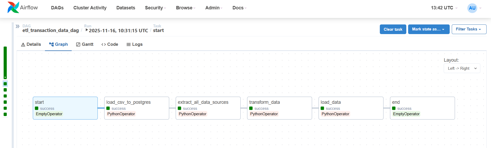
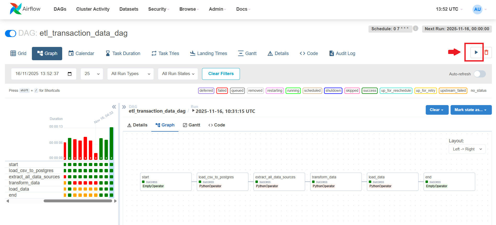

# ETL Transaction Data Pipeline (Apache Airflow)

This project contains an automated ETL pipeline built using **Apache Airflow**.  
The pipeline extracts data from CSV and PostgreSQL sources, transforms it, and loads it into the final PostgreSQL database for analytics.

### 📁 Project Structure
```
├── dags/
│   └── etl_transaction_data_dag.py
│
├── scripts/
│   ├── extract_data.py
│   ├── transform_data.py
│   └── load_data.py
│
├── data/
│   ├── input/
│   │   - (input_data.csv)
│   └── output/
│       - (output_data.csv)
│
├── docker-compose.yml
├── requirements.txt
└── README.md
```
### 📝 Dependencies Required
```
apache-airflow==2.7.1
apache-airflow-providers-postgres

pandas
pendulum

psycopg2-binary
SQLAlchemy
```


### 🔄 Pipeline Overview



### **Extract**
- Reads 5 CSV files as raw input.
- Converts 2 CSV tables (`dummy_transaksi_bus`, `dummy_transaksi_halte`) into PostgreSQL tables.
- Produces 3 CSV-based sources and 2 PostgreSQL-based sources.

### **Transform**
- Cleans and preprocesses all extracted datasets.
- Applies data quality rules and transformations.
- Generates unified, analytics-ready dataset.

### **Load**
- Exports the final transformed tables into:

    - PostgreSQL (fact & aggregations tables)

    - CSV report files in ```/data/output/```


### ⏰ Scheduling

The pipeline runs **every day at 07:00 (Asia/Jakarta)**.


```
schedule_interval="0 7 * * *"
```

### 🐳 Running with Docker
#### 1. Start Airflow
```
docker-compose up --build -d
```

#### 2. Access Airflow Web UI 
http://localhost:8080

Login (default):
- **Username:** admin  
- **Password:** admin  

#### 3. Setting Up PostgreSQL Connection in Airflow
To enable the ETL pipeline to communicate with the PostgreSQL database, you need to configure a connection in the Airflow UI. 

- Open Airflow Web UI.

- Navigate to Admin → Connections.

- Click “+ Add Connection”.

- Fill in the following details:

| Field         | Value              |
| ------------- | ------------------ |
| **Conn Id**   | `postgres_default` |
| **Conn Type** | Postgres           |
| **Host**      | `postgres`         |
| **Schema**    | `airflow`          |
| **Login**     | `airflow`          |
| **Password**  | `airflow`          |
| **Port**      | `5432`             |

- Click Save.

📌 Note:

- The host postgres comes from ```docker-compose.yml```.

- The DAG expects the connection ID ```postgres_default```.

#### 4. Start the Pipeline


Trigger the DAG using the Play (►) button in Airflow.
Airflow will run all tasks in sequence—from ```start``` → CSV loading → extraction → transformation → data loading → ```end```.
Each step follows task dependencies automatically.

